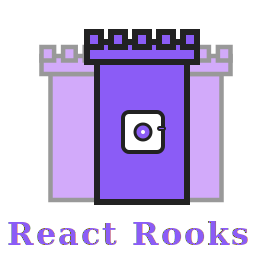

# React Rooks



> **A lightweight state management library for React that brings the simplicity of `useState` to global and contextual state.** Just like a chess rook moves in straight lines, your state updates are direct, predictable, and powerful.

[](https://badge.fury.io/js/react-rooks)
[](http://www.typescriptlang.org/)
[](https://opensource.org/licenses/MIT)

**[Interactive Demo](https://nastuzzisamy.github.io/react-rooks/)** · [Quick Start](#quick-start) · [API Reference](#api-reference) · [Zod Integration](#zod-integration)

---

## Why React Rooks?

If you love `useState` but need global state, React Rooks is for you. It's designed to feel exactly like React's built-in hooks while providing powerful state management capabilities.

- **Ultra lightweight** — no runtime dependencies, pure React
- **Hook-first design** — feels exactly like `useState`, but global
- **Type-safe** — full TypeScript support with automatic inference
- **Zero boilerplate** — no actions, reducers, or selectors required
- **Flexible** — global stores, scoped stores, multiple stores
- **Tree-shakable** — only bundle what you use
- **Schema validation** — optional Zod integration via `react-rooks/zod`

---

## Comparison

| Feature                | React Rooks | Redux Toolkit | Zustand   | Jotai     | Valtio    |
| ---------------------- | ----------- | ------------- | --------- | --------- | --------- |
| **Bundle size**        | ~2KB        | ~47KB         | ~8KB      | ~13KB     | ~14KB     |
| **useState-like API**  | Yes         | No            | Similar   | Similar   | Different |
| **TypeScript support** | Excellent   | Good          | Good      | Excellent | Good      |
| **Zero boilerplate**   | Yes         | No            | Yes       | Yes       | Yes       |
| **Multiple stores**    | Yes         | Yes           | Yes       | Yes       | Yes       |
| **Scoped providers**   | Yes         | No            | Manual    | Yes       | Manual    |
| **Schema validation** | Zod         | No            | No        | No        | No        |
| **Reducers**          | Optional    | Required      | Optional  | Yes       | No        |

---

## Quick Start

### Installation

```bash
# Using bun (recommended)
bun add react-rooks

# Using npm
npm install react-rooks

# Using yarn
yarn add react-rooks
```

### Basic Usage

```tsx
import { createRook } from "react-rooks";

// 1. Create a store (like useState, but global)
export const [UserStore, useUser] = createRook({
  name: "John Doe",
  email: "john@example.com",
  theme: "light" as "light" | "dark",
});

// 2. Use anywhere in your app
function UserProfile() {
  const [name, setName] = useUser("name");
  const [email, setEmail] = useUser("email");

  return (
    <div>
      <input value={name} onChange={(e) => setName(e.target.value)} />
      <input value={email} onChange={(e) => setEmail(e.target.value)} />
    </div>
  );
}

// 3. Wrap your app
function App() {
  return (
    <UserStore>
      <UserProfile />
    </UserStore>
  );
}
```

---

## useState vs useRook

React Rooks is designed to feel **exactly** like `useState`:

| **useState (React)**                    | **useRook (React Rooks)**                    |
| --------------------------------------- | -------------------------------------------- |
| `const [count, setCount] = useState(0)` | `const [count, setCount] = useRook("count")` |
| Component-scoped                        | Global or contextual scope                   |
| Direct updates                          | Direct updates                               |
| Type-safe                               | Type-safe                                    |

### Migration is easy

```tsx
// Before: component state
function Counter() {
  const [count, setCount] = useState(0);
  return <button onClick={() => setCount((c) => c + 1)}>{count}</button>;
}

// After: global state (same API)
const [CounterStore, useCounter] = createRook({ count: 0 });

function Counter() {
  const [count, setCount] = useCounter("count");
  return <button onClick={() => setCount((c) => c + 1)}>{count}</button>;
}
```

---

## API Reference

### `createRook(initialStore, reducers?)`

Creates a global store with optional reducers.

```tsx
import { createRook } from "react-rooks";

// Basic store
const [Store, useStore] = createRook({
  count: 0,
  user: { name: "", email: "" },
});

// With reducers
const [Store, useStore] = createRook(
  { count: 0 },
  {
    count: (state, action) => {
      switch (action.type) {
        case "increment":
          return state + 1;
        case "decrement":
          return state - 1;
        default:
          return state;
      }
    },
  }
);
```

### `useRook(key?)`

Hook to access store values.

```tsx
// Access a specific key
const [count, setCount] = useRook("count");

// Access the entire store
const [store, setStore] = useRook();

// Functional updates
setCount((prevCount) => prevCount + 1);

// Direct updates
setCount(42);
```

### `RookContainer`

Combine multiple stores.

```tsx
import { RookContainer } from "react-rooks";

const [UserStore] = createRook({ name: "" });
const [ThemeStore] = createRook({ mode: "light" });

function App() {
  return (
    <RookContainer rooks={[UserStore, ThemeStore]}>
      <MyApp />
    </RookContainer>
  );
}
```

**Order matters.** Stores are nested from top to bottom: components lower in the tree can access stores from higher levels.

```tsx
// Correct: CartStore can access UserStore and ThemeStore
<RookContainer rooks={[UserStore, ThemeStore, CartStore]}>
  <App />
</RookContainer>

// Wrong: UserStore can't access CartStore or ThemeStore
<RookContainer rooks={[CartStore, ThemeStore, UserStore]}>
  <App />
</RookContainer>
```

---

## Zod Integration

React Rooks ships optional runtime validation powered by [Zod v4](https://zod.dev) via the `react-rooks/zod` entry point.

### Installation

```bash
bun add react-rooks zod
```

Zod is an optional peer dependency, so it's only pulled in when you use it.

### Usage

```tsx
import { createZodRook } from "react-rooks/zod";
import { z } from "zod";

const UserSchema = z.object({
  name: z.string().min(1).default(""),
  email: z.email().default(""),
  age: z.number().min(0).max(120).default(0),
});

const [UserStore, useUser] = createZodRook(UserSchema, {
  onValidationError: (error) => {
    // Handle validation errors gracefully
    console.error("Invalid store update:", error);
  },
});
```

Every field in the schema must declare a default, be optional, or be nullable. This guarantees the store can be initialized from `schema.parse({})` without errors.

### Features

- **Runtime validation** — every update is validated against the schema
- **Type inference** — store types are inferred from your schema
- **Custom reducer** — pass `storeReducer` to shape values before validation
- **Error handler** — invalid updates are rejected and reported via `onValidationError`

### Advanced example

```tsx
import { createZodRook } from "react-rooks/zod";
import { z } from "zod";

enum Locale {
  EN = "en",
  FR = "fr",
}

const schema = z.object({
  user: z
    .object({ id: z.number(), name: z.string() })
    .nullable()
    .transform((val) => (val ? { id: val.id, name: val.name } : null)),
  locale: z.enum(Locale).default(Locale.EN),
  title: z.string().default("My React app"),
  inputNumber: z.coerce.number().optional(),
});

export const [Rook, useRook] = createZodRook(schema, {
  onValidationError: (error, values, currentStore) => {
    console.error("Validation error:", error);
    console.error("Rejected values:", values);
    console.error("Current store:", currentStore);
  },
});
```

---

## Advanced Features

### Multiple stores with scoping

```tsx
const [UserStore, useUser] = createRook({
  profile: { name: "", email: "" },
  preferences: { theme: "light", notifications: true },
});

const [CartStore, useCart] = createRook({
  items: [],
  total: 0,
});

// Use them together
function App() {
  return (
    <RookContainer rooks={[UserStore, CartStore]}>
      <Header />
      <MainContent />
      <Footer />
    </RookContainer>
  );
}

// Or scope them to specific parts of your app
function UserSection() {
  return (
    <UserStore>
      <UserProfile />
      <UserSettings />
    </UserStore>
  );
}
```

### Store order and dependencies

The order of stores in `RookContainer` is crucial. Stores are nested from top to bottom, so components can only access stores positioned above them in the array.

```tsx
// Recommended order patterns:

// E-commerce app:
<RookContainer rooks={[
  AuthStore,       // 1. Authentication (most fundamental)
  ThemeStore,      // 2. UI preferences
  UserStore,       // 3. User data
  CartStore,       // 4. Shopping functionality
  CheckoutStore,   // 5. Specific features
]}>

// Admin dashboard:
<RookContainer rooks={[
  AuthStore,       // 1. Who is logged in?
  PermissionStore, // 2. What can they do?
  ThemeStore,      // 3. How does it look?
  DataStore,       // 4. Application data
]}>
```

**Best practices:**

1. **Order by dependency.** Place stores that others depend on first.
2. **Logical hierarchy.** User → Theme → Feature-specific stores.
3. **Scope appropriately.** Only include stores that components actually need.

### Custom reducers

```tsx
const [TodoStore, useTodos] = createRook(
  {
    todos: [],
    filter: "all",
  },
  {
    todos: (state, action) => {
      switch (action.type) {
        case "ADD_TODO":
          return [...state, { id: Date.now(), text: action.text, done: false }];
        case "TOGGLE_TODO":
          return state.map((todo) =>
            todo.id === action.id ? { ...todo, done: !todo.done } : todo
          );
        case "DELETE_TODO":
          return state.filter((todo) => todo.id !== action.id);
        default:
          return state;
      }
    },
  }
);

function TodoList() {
  const [todos, dispatch] = useTodos("todos");

  const addTodo = (text: string) => dispatch({ type: "ADD_TODO", text });
  const toggleTodo = (id: number) => dispatch({ type: "TOGGLE_TODO", id });
}
```

### Server-side rendering (SSR)

```tsx
import { createRook } from "react-rooks";

const [AppStore, useApp] = createRook({
  user:
    typeof window !== "undefined"
      ? JSON.parse(localStorage.getItem("user") || "null")
      : null,
  theme:
    typeof window !== "undefined"
      ? localStorage.getItem("theme") || "light"
      : "light",
});

function App({ initialData }: { initialData?: any }) {
  return (
    <AppStore initialValue={initialData}>
      <MyApp />
    </AppStore>
  );
}
```

---

## Real-World Comparison: Shopping Cart

The same shopping cart feature, implemented across different state management solutions. Same functionality — different complexity.

### React Rooks (22 lines)

```tsx
import { createRook } from "react-rooks";

// 1. Create store (2 lines)
const [CartStore, useCart] = createRook({
  items: [] as Array<{
    id: number;
    name: string;
    price: number;
    quantity: number;
  }>,
  total: 0,
});

// 2. Hook for actions (6 lines)
function useCartActions() {
  const [items, setItems] = useCart("items");
  const [, setTotal] = useCart("total");

  const addItem = (item: (typeof items)[0]) => {
    const newItems = [...items, item];
    setItems(newItems);
    setTotal(newItems.reduce((sum, i) => sum + i.price * i.quantity, 0));
  };

  const removeItem = (id: number) => {
    const newItems = items.filter((i) => i.id !== id);
    setItems(newItems);
    setTotal(newItems.reduce((sum, i) => sum + i.price * i.quantity, 0));
  };

  return { addItem, removeItem };
}

// 3. Component (12 lines)
function ShoppingCart() {
  const [items] = useCart("items");
  const [total] = useCart("total");
  const { addItem, removeItem } = useCartActions();

  return (
    <div>
      <h2>Cart ({items.length} items) - ${total.toFixed(2)}</h2>
      {items.map((item) => (
        <div key={item.id}>
          {item.name} - ${item.price} x {item.quantity}
          <button onClick={() => removeItem(item.id)}>Remove</button>
        </div>
      ))}
      <button
        onClick={() =>
          addItem({ id: Date.now(), name: "New Item", price: 10, quantity: 1 })
        }
      >
        Add Item
      </button>
    </div>
  );
}

// 4. App wrapper (2 lines)
function App() {
  return (
    <CartStore>
      <ShoppingCart />
    </CartStore>
  );
}
```

### Redux Toolkit (65 lines)

```tsx
import { configureStore, createSlice, PayloadAction } from "@reduxjs/toolkit";
import { Provider, useSelector, useDispatch } from "react-redux";

interface CartItem {
  id: number;
  name: string;
  price: number;
  quantity: number;
}

interface CartState {
  items: CartItem[];
  total: number;
}

const cartSlice = createSlice({
  name: "cart",
  initialState: { items: [], total: 0 } as CartState,
  reducers: {
    addItem: (state, action: PayloadAction<CartItem>) => {
      state.items.push(action.payload);
      state.total = state.items.reduce(
        (sum, item) => sum + item.price * item.quantity,
        0
      );
    },
    removeItem: (state, action: PayloadAction<number>) => {
      state.items = state.items.filter((item) => item.id !== action.payload);
      state.total = state.items.reduce(
        (sum, item) => sum + item.price * item.quantity,
        0
      );
    },
  },
});

const store = configureStore({ reducer: { cart: cartSlice.reducer } });
type RootState = ReturnType<typeof store.getState>;
const { addItem, removeItem } = cartSlice.actions;

function ShoppingCart() {
  const { items, total } = useSelector((state: RootState) => state.cart);
  const dispatch = useDispatch();

  return (
    <div>
      <h2>Cart ({items.length} items) - ${total.toFixed(2)}</h2>
      {items.map((item) => (
        <div key={item.id}>
          {item.name} - ${item.price} x {item.quantity}
          <button onClick={() => dispatch(removeItem(item.id))}>Remove</button>
        </div>
      ))}
      <button
        onClick={() =>
          dispatch(
            addItem({
              id: Date.now(),
              name: "New Item",
              price: 10,
              quantity: 1,
            })
          )
        }
      >
        Add Item
      </button>
    </div>
  );
}

function App() {
  return (
    <Provider store={store}>
      <ShoppingCart />
    </Provider>
  );
}
```

### Summary

| Metric                   | React Rooks | Redux Toolkit | Zustand | Context + useState |
| ------------------------ | ----------- | ------------- | ------- | ------------------ |
| **Lines of code**        | 22          | 65            | 35      | 45                 |
| **Concepts to learn**    | 1           | 5             | 2       | 3                  |
| **Boilerplate required** | Minimal     | Heavy         | Medium  | Medium             |
| **TypeScript inference** | Automatic   | Manual        | Manual  | Manual             |
| **useState-like API**    | Yes         | No            | Partial | Yes                |

**Same functionality, 66% less code, 80% fewer concepts.**

---

## Demo

Experience React Rooks with the interactive demo application. It includes todo lists, counters, scoped stores, reducer patterns, live state inspection, and hover-to-see implementation tooltips.

```bash
git clone https://github.com/NastuzziSamy/react-rooks.git
cd react-rooks/demo
bun install && bun dev
```

---

## Roadmap

### v2.x — Performance & Lifecycle

- **Smart re-renders** — limit re-renders in `useRook` when the accessed key hasn't changed
- **Initialization callbacks** — execute a callback once a store has finished initializing
- **Lazy mounting** — allow children to render before the store is ready (currently, providers block children until init completes)

### v3.x — Developer Experience

- **DevTools integration** — debug state changes with a timeline and diff viewer
- **Persistence** — automatic state persistence to localStorage / sessionStorage
- **Time travel** — undo / redo in development

### v4.x — Advanced Schema Features

- **Schema evolution** — migrations and versioning
- **Conditional validation** — dynamic schemas based on store state
- **Cross-store validation** — validate data across multiple stores
- **Validation analytics** — track validation errors and patterns

---

## Philosophy: The Chess Rook

Just like a rook in chess, React Rooks represents:

- **Centralized power** — a strong, reliable foundation for your state
- **Straight lines** — direct, predictable state updates, no magic
- **Strategic position** — can be placed anywhere in your component tree
- **Defensive** — type-safe and validated data protection
- **Fast movement** — instant updates across your entire application

The rook doesn't move in complex patterns. It's straightforward, powerful, and reliable. That's exactly how your state management should be.

---

## Contributing

Contributions are welcome. Please see our [Contributing Guide](CONTRIBUTING.md) for details.

### Development setup

```bash
git clone https://github.com/NastuzziSamy/react-rooks.git
cd react-rooks

bun install
bun run test
bun run build
```

---

## License

MIT © [Samy NASTUZZI](https://github.com/NastuzziSamy)
